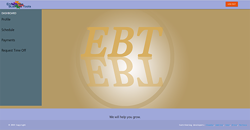

# projectTwo

# Enterprise Business Tool
#### In this project we have created an app that will
offer a number of features under our template so that employers
can easily manage resources, employees, and stock. 
Multiple access levels for management to choose from, allowing for
authentication based management.  
Comments system that allows for management to relay important
information targeted to either all employees, or just between each
other.

#### Enterprise Business Tool will 
be giving you and your employees the ability to make better,
faster decisions and access information from virtually anywhere by

1. Aligning business values with raw data
2. Utilizing real-time data to leverage change
3. Managing and deploying robust real-time solutions
4. Reconciling systems of record and systems of engagement
